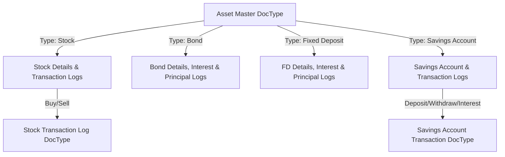

# Asset Portfolio Management System

This document outlines the detailed functional and technical design for the **Asset Portfolio Management** module, built as a Frappe Custom App using the Frappe Framework.

## 1. Architecture Overview

The system uses Frappe's metadata-driven architecture. We will define:
1. **Core DocTypes**: For managing assets (Asset Master), transactions, and repayment schedules.
2. **Child Tables**: For inline logs like interest/principal repayments and minor logs.
3. **Custom Reports**: Script Reports and Query Reports for portfolio performance, asset allocation, and XIRR.
4. **Dashboard**: A custom Frappe Dashboard with charts for overall portfolio visibility.

---

## 2. Database Schema & DocTypes

To maintain clean data structures and consolidated reporting, we will implement the **Asset Master** as a single DocType with conditional fields (using Frappe's `depends_on` functionality) for asset-specific attributes. Transaction ledgers will be stored in separate DocTypes linked to the main Asset record.

### 2.1 DocType: `Asset Portfolio` (Asset Master)
This is the primary DocType. It acts as the Asset Master.

| Field Name | Type | Label | Details / Options | Show Condition (depends_on) |
| :--- | :--- | :--- | :--- | :--- |
| **Common Fields** | | | | |
| `asset_id` | Data | Asset ID | Unique Identifier (Autogenerated or Manual) | Always |
| `asset_name` | Data | Asset Name | e.g. "HDFC Bank Ltd", "SBI FD 2026" | Always |
| `asset_type` | Select | Asset Type | Stock, Bond, Fixed Deposit, Savings Account, PF, PPF, NPS | Always |
| `provider` | Data | Provider / Institution | e.g. Zerodha, HDFC Bank, SBI | Always |
| `owner` | Link | Owner | Link to `User` or a custom `Portfolio Owner` DocType | Always |
| `date_of_investment` | Date | Date of Investment | Date of initial purchase/deposit | Always |
| `investment_value` | Currency | Investment Value | Initial/Principal investment amount | Always |
| `current_value` | Currency | Current Value | Market value or current balance | Always |
| `total_gain_loss` | Currency | Total Gain / Loss | Calculated: `current_value - investment_value` | Always |
| `total_return_pct`| Percent | Total Return % | Calculated: `(total_gain_loss / investment_value) * 100` | Always |
| `xirr` | Percent | XIRR | Calculated annualized return using transactions | Always |
| `status` | Select | Status | Active, Matured, Closed | Always |
| `notes` | Text | Notes | Additional notes | Always |
| **Stock Fields** | | | | |
| `demat_account` | Link | Demat Account | Link to `Demat Account` DocType | `eval:doc.asset_type=='Stock'` |
| `industry` | Data | Industry | e.g. Banking, IT, Auto | `eval:doc.asset_type=='Stock'` |
| `stock_category` | Select | Stock Category | Large Cap, Mid Cap, Small Cap, Micro Cap | `eval:doc.asset_type=='Stock'` |
| `quantity_held` | Float | Quantity Held | Total shares currently held | `eval:doc.asset_type=='Stock'` |
| `avg_purchase_price`| Currency| Average Purchase Price| Calculated from transaction history | `eval:doc.asset_type=='Stock'` |
| `current_market_price`| Currency| Current Market Price| Manually entered or fetched via API | `eval:doc.asset_type=='Stock'` |
| `last_updated_date`| Datetime | Last Updated Date | Timestamp of price update | `eval:doc.asset_type=='Stock'` |
| **Bond Fields** | | | | |
| `bond_demat_account`| Link | Demat Account | Link to `Demat Account` | `eval:doc.asset_type=='Bond'` |
| `bond_face_value` | Currency | Bond Face Value | Par value of one bond | `eval:doc.asset_type=='Bond'` |
| `no_of_bonds` | Int | Number of Bonds | | `eval:doc.asset_type=='Bond'` |
| `maturity_date` | Date | Maturity Date | | `eval:doc.asset_type=='Bond'` or FD |
| `interest_paid` | Currency | Interest Paid | Total interest payouts received | `eval:doc.asset_type=='Bond'` |
| `interest_unpaid` | Currency | Interest Unpaid | Pending interest payouts | `eval:doc.asset_type=='Bond'` |
| `principal_paid` | Currency | Principal Paid | Total principal returned | `eval:doc.asset_type=='Bond'` |
| `principal_unpaid` | Currency | Principal Unpaid | Remaining principal outstanding | `eval:doc.asset_type=='Bond'` |
| `bond_rating` | Select | Bond Rating | AAA, AA+, AA, A, BBB, Others | `eval:doc.asset_type=='Bond'` |
| `security_class` | Select | Security Class | Secured Debenture, Unsecured Debenture, Government Bond, Corporate Bond | `eval:doc.asset_type=='Bond'` |
| `interest_frequency`| Select | Interest Frequency | Monthly, Quarterly, Half-Yearly, Yearly | `eval:doc.asset_type=='Bond'` |
| `repayment_priority`| Select | Repayment Priority | Senior Secured, Senior Unsecured, Subordinated, Junior | `eval:doc.asset_type=='Bond'` |
| `bond_interest_schedule` | Table | Interest Schedule | Child Table: `Bond Interest Log` | `eval:doc.asset_type=='Bond'` |
| `bond_principal_schedule`| Table | Principal Schedule| Child Table: `Bond Principal Log` | `eval:doc.asset_type=='Bond'` |
| **Fixed Deposit Fields** | | | | |
| `fd_account_number`| Data | Account Number | Bank FD Account Number | `eval:doc.asset_type=='Fixed Deposit'` |
| `fd_interest_rate` | Percent | Interest Rate | Annual interest rate | `eval:doc.asset_type=='Fixed Deposit'` |
| `fd_interest_paid` | Currency | Interest Paid | Accumulated interest received | `eval:doc.asset_type=='Fixed Deposit'` |
| `fd_interest_unpaid`| Currency| Interest Unpaid | Accrued but unpaid interest | `eval:doc.asset_type=='Fixed Deposit'` |
| `fd_principal_paid` | Currency | Principal Paid | Returned principal | `eval:doc.asset_type=='Fixed Deposit'` |
| `fd_principal_unpaid`| Currency| Principal Unpaid | Outstanding principal | `eval:doc.asset_type=='Fixed Deposit'` |
| `fd_interest_frequency`| Select | Interest Frequency | Monthly, Quarterly, Half-Yearly, Yearly, On Maturity | `eval:doc.asset_type=='Fixed Deposit'` |
| `fd_interest_schedule`| Table | Interest Payments | Child Table: `FD Interest Log` | `eval:doc.asset_type=='Fixed Deposit'` |
| `fd_principal_schedule`| Table | Principal Repayments| Child Table: `FD Principal Log` | `eval:doc.asset_type=='Fixed Deposit'` |
| **Savings Account Fields** | | | | |
| `sa_account_number`| Data | Account Number | Bank Account Number | `eval:doc.asset_type=='Savings Account'` |

---

### 2.2 Supporting DocTypes & Child Tables

#### 1. DocType: `Stock Transaction Log`
Tracks stock purchases and sales.
* `asset` (Link -> `Asset Portfolio`, filter: `asset_type=='Stock'`)
* `transaction_date` (Date)
* `transaction_type` (Select: Buy, Sell)
* `quantity` (Float)
* `price` (Currency)
* `brokerage` (Currency)
* `taxes_fees` (Currency)
* `total_amount` (Currency) - Calculated:
  * For Buy: `(quantity * price) + brokerage + taxes_fees`
  * For Sell: `(quantity * price) - brokerage - taxes_fees`
* `realized_gain_loss` (Currency) - For Sell transactions.

#### 2. DocType: `Savings Account Transaction Log`
Tracks bank account statements.
* `asset` (Link -> `Asset Portfolio`, filter: `asset_type=='Savings Account'`)
* `transaction_date` (Date)
* `transaction_type` (Select: Deposit, Withdrawal, Interest Credit)
* `amount` (Currency)
* `narration` (Small Text)
* `reference_number` (Data)

#### 3. Child DocType: `Bond Interest Log` (Table)
* `payment_date` (Date)
* `interest_amount` (Currency)
* `period_covered` (Data)
* `status` (Select: Paid, Pending)

#### 4. Child DocType: `Bond Principal Log` (Table)
* `repayment_date` (Date)
* `amount` (Currency)
* `outstanding_principal` (Currency)

#### 5. Child DocType: `FD Interest Log` (Table)
* `payment_date` (Date)
* `interest_amount` (Currency)
* `period_covered` (Data)

#### 6. Child DocType: `FD Principal Log` (Table)
* `repayment_date` (Date)
* `amount` (Currency)
* `outstanding_balance` (Currency)

#### 7. DocType: `Portfolio Owner`
Simple master list of owners.
* `owner_name` (Data, unique)
* `email` (Data)

#### 8. DocType: `Demat Account`
Simple master list of Demat accounts.
* `account_id` (Data, unique)
* `broker_name` (Data)
* `owner` (Link -> `Portfolio Owner`)

---

## 3. Calculation & Automation Logic

### 3.1 Stock Value Calculations
On submission of any `Stock Transaction Log`:
1. Recalculate `quantity_held` as `Sum(Buy.quantity) - Sum(Sell.quantity)`.
2. Recalculate `avg_purchase_price`:
   * Formula: Weighted average purchase price of active holdings.
   * `total_cost = total_cost + new_buy_cost`
   * On Sell, quantity is reduced but `avg_purchase_price` remains the same.
3. Update `investment_value` as `quantity_held * avg_purchase_price`.
4. Update `current_value` as `quantity_held * current_market_price`.
5. Update `total_gain_loss` as `current_value - investment_value`.
6. Calculate `xirr` using cash flows (Negative for buys, positive for sells, plus current value on today's date).

### 3.2 Bond & FD Value Calculations
When interest/principal logs are updated:
1. `interest_paid` = Sum of all interest logs marked "Paid" or logged.
2. `principal_paid` = Sum of all principal repayments.
3. `current_value` = `investment_value - principal_paid` (Outstanding Principal).
4. `total_gain_loss` = `(current_value + interest_paid + principal_paid) - investment_value`.
5. Recalculate `total_return_pct` and `xirr`.

### 3.3 Savings Account Value Calculations
On submission of `Savings Account Transaction Log`:
1. `current_value` (Current Balance) = `Sum(Deposits) + Sum(Interest Credits) - Sum(Withdrawals)`.
2. Update the parent `Asset Portfolio` `current_value` field.
3. `investment_value` is defined as initial deposit or can match current balance minus interest. We will set it to `Sum(Deposits) - Sum(Withdrawals)`.
4. `total_gain_loss` = `current_value - investment_value` (which represents cumulative Interest Credit).

---

## 4. XIRR Calculation Engine

XIRR (Extended Internal Rate of Return) will be calculated in Python using numerical solvers (e.g. `scipy.optimize.newton` or a robust pure-Python implementation to avoid heavy dependency issues in generic Frappe sites).

### Pure-Python XIRR Implementation
We will use the Newton-Raphson method:
$$\sum_{i=1}^{N} \frac{C_i}{(1 + r)^{\frac{d_i - d_1}{365}}} = 0$$
Where:
* $C_i$ is the cash flow amount.
* $d_i$ is the cash flow date.
* $r$ is the XIRR rate.

**Cash Flow Mapping for XIRR:**
1. **Initial Outflow**: Negative `investment_value` on `date_of_investment`.
2. **Intermediate Cash Flows**:
   * For Stocks: Buys are negative, Sells/Dividends are positive.
   * For Bonds/FDs: Principal repayments and Interest payouts are positive.
   * For Savings: Deposits are negative, Withdrawals are positive.
3. **Terminal Value**: Current market value/balance on current date (positive cash flow).

---

## 5. Reports

### 5.1 Stock Reports
1. **Portfolio Allocation by Industry** (Pie chart + Table)
2. **Portfolio Allocation by Market Cap** (Pie chart + Table)
3. **Realized vs Unrealized Gains** (Bar chart + Table)
4. **Broker-wise Holdings** (Table)

### 5.2 Bond & FD Reports
1. **Upcoming Maturity Report**: Filters Bond/FD assets where `maturity_date` is in the future.
2. **Bond Rating Exposure**: Allocation across AAA, AA+, AA, etc.
3. **Interest Income Report**: Summary of interest earned per month/quarter.
4. **Cash Flow Schedule**: Calendar/Timeline of expected interest and principal inflows.

### 5.3 Savings Account Reports
1. **Account Balance History**: Trend of balances over time.
2. **Monthly Cash Flow**: Monthly aggregate deposits vs withdrawals.

### 5.4 Consolidated Dashboard
* **KPI Cards**: Total Portfolio Value, Total Investment, Total Gain/Loss, Consolidated XIRR.
* **Allocation Charts**: Asset Type Allocation, Provider Allocation, Owner Allocation.

---

## 6. Implementation Checklist & Phase Details

### Phase 1: Setup & Custom App Initialization
- [ ] Initialize Frappe custom app `asset_portfolio_management`.
- [ ] Create base DocTypes: `Portfolio Owner`, `Demat Account`.
- [ ] Create `Asset Portfolio` (Asset Master) DocType.
- [ ] Create child DocTypes for Bond/FD interest and principal logs.

### Phase 2: Transaction Ledger & Python Controller Logic
- [ ] Create `Stock Transaction Log` and `Savings Account Transaction Log` DocTypes.
- [ ] Implement CRUD hooks on transaction logs to automatically update parent `Asset Portfolio` statistics.
- [ ] Implement the XIRR calculation engine in Python utility module.
- [ ] Add unit tests for transaction logic and XIRR solver.

### Phase 3: Web Dashboard & Reports
- [ ] Create Script Reports for Industry/Market Cap allocations.
- [ ] Build the consolidated script report containing all assets with XIRR.
- [ ] Build the Custom Dashboard page with standard Frappe Charts.

### Phase 4: UI/UX & Final Polish
- [ ] Style the dashboard using modern, responsive CSS.
- [ ] Implement filters (Owner, Asset Type, Date Range) on dashboard.
- [ ] Add Export to Excel / PDF capabilities for reports.
